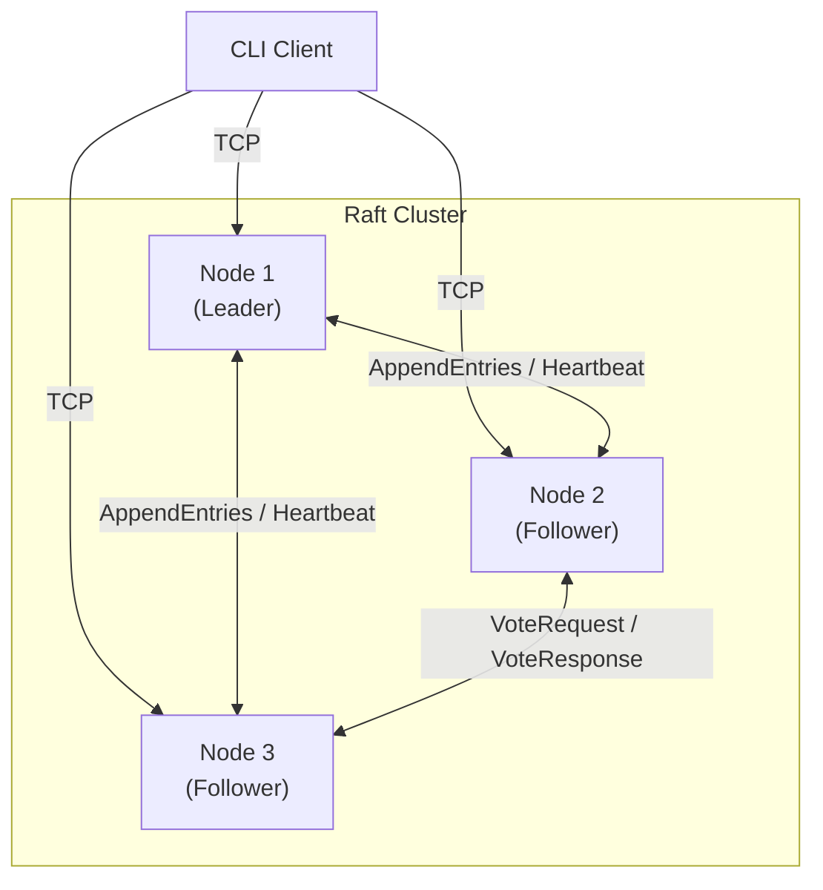
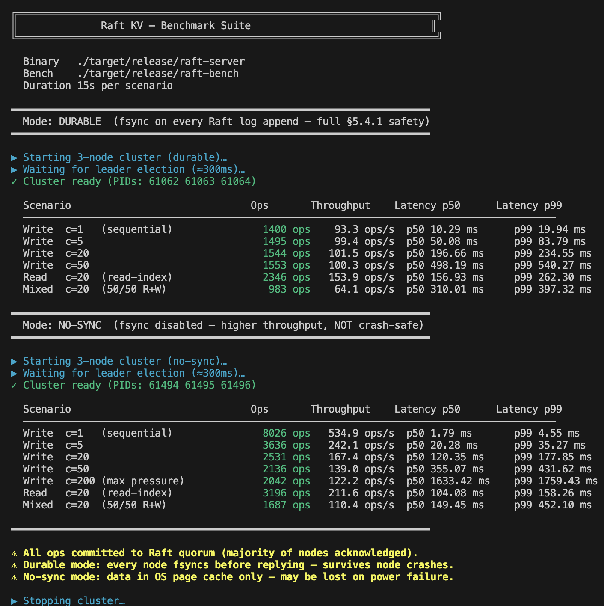

# raft-kv

A distributed key-value store built in Rust using the [Raft consensus protocol](https://raft.github.io/raft.pdf).

Built as a portfolio project demonstrating distributed systems fundamentals: leader election, log replication, linearizable reads, and fault tolerance.

## Architecture



Each node runs three concurrent subsystems:
- **Raft Engine** — pure state machine for leader election and log replication
- **Network Transport** — TCP connections to peers with automatic reconnection
- **KV State Machine** — applies committed log entries to an in-memory store

## Workspace layout

```
crates/
  raft-core/     # Pure Raft logic — zero I/O, zero async
    src/
      config.rs      # RaftConfig (timeouts, cluster size)
      message.rs     # All RPC types + wire envelope
      log.rs         # Immutable RaftLog
      state.rs       # Role, PersistentState, Actions command object
      node.rs        # RaftNode state machine (all transitions -> Actions)

  raft-server/   # Async TCP node (library + binary)
    src/
      lib.rs         # Library face (used by integration tests)
      codec.rs       # Length-delimited bincode framing
      transport.rs   # TCP acceptor + sender; handles both peer and client conns
      kv.rs          # Immutable KvStore state machine
      storage.rs     # Crash-safe fsync persistence
      node.rs        # tokio::select! event loop (Option<RaftNode> ownership)
      main.rs        # CLI: --id, --addr, --peers, --data-dir, --no-sync
    tests/
      e2e.rs         # Integration tests (in-process NodeActor, raw TCP client)

  raft-bench/    # Load testing binary
    src/
      main.rs        # Concurrent async clients, latency percentiles, ghz-style report

  raft-client/   # CLI client binary
    src/
      codec.rs       # Same wire format as server
      connection.rs  # Auto-reconnect + leader-redirect following
      main.rs        # get / put / delete subcommands
```

## Key design decisions

### Pure core, I/O-free
`raft-core` has no async runtime, no networking, and no file I/O. Every method on `RaftNode` takes `self` by value and returns `(RaftNode, Actions)`. The `Actions` struct is a command object listing side-effects (messages to send, entries to apply, state to persist) that the server layer executes.

This makes the entire Raft logic unit-testable without any mocking.

### Immutability throughout
`RaftLog::append` and `RaftLog::truncate_from` return new instances. `KvStore::apply` returns a new store. `RaftNode` transitions return new node state. No mutation in-place.

### Commitment rule (5.4.2)
The leader only advances `commit_index` for entries whose `term == current_term`. This prevents the "Figure 8" problem where a leader could incorrectly commit entries from a previous term.

### Crash-safe persistence
Before responding to any RPC, the server writes durable state (`current_term`, `voted_for`, log) to disk using an atomic `write -> fsync -> rename` sequence.

### Read-index protocol
GET requests record `read_index = commit_index` and trigger a heartbeat round to confirm the node is still the active leader before serving the read. This prevents stale reads from a deposed leader.

### Transport peer identity
Every response message (`VoteResponse`, `AppendEntriesResponse`) carries a `peer_id` field. When `send_loop` opens a new TCP connection to deliver a response, the receiver uses this field to identify the sender — eliminating a class of "unexpected first message" drops that would prevent leader election in production.

## Tests

```
cargo test --workspace
```

28 tests, all passing:
- 7 log unit tests (append, truncate, query, immutability)
- 10 Raft node unit tests (election, replication, step-down, single-node)
- 6 KV state machine unit tests
- 5 end-to-end integration tests (single-node, 3-node basic ops, concurrent writes, throughput, leader failover)

## Benchmarks

```bash
# Build release binaries first
cargo build --release --bin raft-server --bin raft-bench

# Full suite — 15s per scenario, durable + no-sync modes
./bench.sh

# Quick mode — 5s per scenario
./bench.sh --quick

# One mode only
./bench.sh --sync-only
./bench.sh --no-sync-only
```



Results from a 3-node localhost cluster (macOS, release build):

| Mode | Scenario | Throughput | p50 latency | p99 latency |
|---|---|---|---|---|
| Durable | Write c=1 | ~95 ops/s | 10 ms | 20 ms |
| Durable | Write c=20 | ~96 ops/s | 206 ms | 286 ms |
| Durable | Read c=20 | ~145 ops/s | 156 ms | 234 ms |
| No-sync | Write c=1 | ~535 ops/s | 1.8 ms | 4.6 ms |
| No-sync | Write c=20 | ~167 ops/s | 120 ms | 178 ms |
| No-sync | Read c=20 | ~212 ops/s | 104 ms | 158 ms |

**Durable mode** — every node fsyncs before acknowledging (`F_FULLFSYNC` on macOS). Throughput is flat at ~95 ops/s regardless of concurrency because the leader event loop serializes fsyncs. This is the correct Raft §5.4.1 behavior.

**No-sync mode** (`--no-sync`) — skips fsync, data lives in the OS page cache. Not crash-safe, but useful for isolating the consensus overhead from the storage overhead. c=1 write latency of 1.8 ms represents the raw TCP round-trip through the Raft pipeline on loopback.

The throughput ceiling with higher concurrency is the Raft leader serializing all writes. Batching proposals (group commit) would push this significantly higher.

## Usage

```bash
# Start a 3-node cluster (durable)
cargo run --release --bin raft-server -- --id 1 --addr 127.0.0.1:7001 \
    --peers 2=127.0.0.1:7002,3=127.0.0.1:7003
cargo run --release --bin raft-server -- --id 2 --addr 127.0.0.1:7002 \
    --peers 1=127.0.0.1:7001,3=127.0.0.1:7003
cargo run --release --bin raft-server -- --id 3 --addr 127.0.0.1:7003 \
    --peers 1=127.0.0.1:7001,2=127.0.0.1:7002

# Single-node cluster (no peers required)
cargo run --release --bin raft-server -- --id 1 --addr 127.0.0.1:7001

# Use the CLI client
cargo run --bin raft-client -- put foo bar
cargo run --bin raft-client -- get foo
cargo run --bin raft-client -- delete foo
```

## References

- [In Search of an Understandable Consensus Algorithm (Raft paper)](https://raft.github.io/raft.pdf)
- [The Secret Lives of Data — Raft visualisation](http://thesecretlivesofdata.com/raft/)
