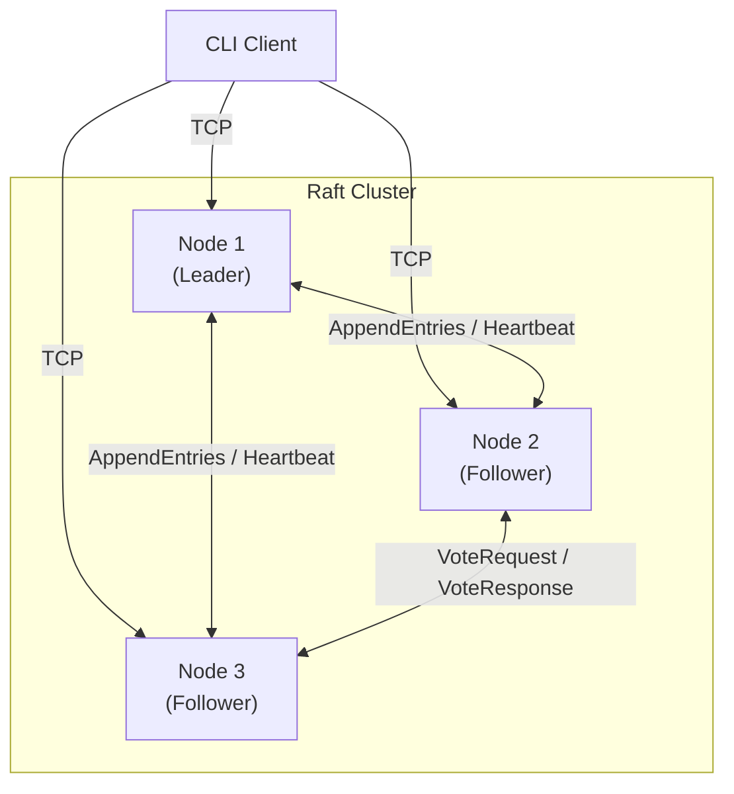

# raft-kv

A distributed key-value store built in Rust using the [Raft consensus protocol](https://raft.github.io/raft.pdf).

Built as a portfolio project demonstrating distributed systems fundamentals: leader election, log replication, linearizable reads, and fault tolerance.

## Architecture



Each node runs three concurrent subsystems:
- **Raft Engine** — pure state machine for leader election and log replication
- **Network Transport** — TCP connections to peers with automatic reconnection
- **KV State Machine** — applies committed log entries to an in-memory store

## Workspace layout

```
crates/
  raft-core/     # Pure Raft logic — zero I/O, zero async
    src/
      config.rs      # RaftConfig (timeouts, cluster size)
      message.rs     # All RPC types + wire envelope
      log.rs         # Immutable RaftLog
      state.rs       # Role, PersistentState, Actions command object
      node.rs        # RaftNode state machine (all transitions → Actions)

  raft-server/   # Async TCP node (library + binary)
    src/
      lib.rs         # Library face (used by integration tests)
      codec.rs       # Length-delimited bincode framing
      transport.rs   # TCP acceptor + sender; handles both peer and client conns
      kv.rs          # Immutable KvStore state machine
      storage.rs     # Crash-safe fsync persistence
      node.rs        # tokio::select! event loop (Option<RaftNode> ownership)
      main.rs        # CLI: --id, --addr, --peers, --data-dir
    tests/
      e2e.rs         # Integration tests (in-process NodeActor, raw TCP client)

  raft-client/   # CLI client binary
    src/
      codec.rs       # Same wire format as server
      connection.rs  # Auto-reconnect + leader-redirect following
      main.rs        # get / put / delete subcommands
```

## Key design decisions

### Pure core, I/O-free
`raft-core` has no async runtime, no networking, and no file I/O. Every method on `RaftNode` takes `self` by value and returns `(RaftNode, Actions)`. The `Actions` struct is a command object listing side-effects (messages to send, entries to apply, state to persist) that the server layer executes.

This makes the entire Raft logic unit-testable without any mocking.

### Immutability throughout
`RaftLog::append` and `RaftLog::truncate_from` return new instances. `KvStore::apply` returns a new store. `RaftNode` transitions return new node state. No mutation in-place.

### Commitment rule (§5.4.2)
The leader only advances `commit_index` for entries whose `term == current_term`. This prevents the "Figure 8" problem where a leader could incorrectly commit entries from a previous term.

### Crash-safe persistence
Before responding to any RPC, the server writes durable state (`current_term`, `voted_for`, log) to disk using an atomic `write → fsync → rename` sequence.

### Read-index protocol
GET requests record `read_index = commit_index` and trigger a heartbeat round to confirm the node is still the active leader before serving the read. This prevents stale reads from a deposed leader.

## Raft protocol coverage

| Feature | Status |
|---|---|
| Leader election (§5.2) | ✅ |
| Log replication (§5.3) | ✅ |
| Safety — commitment rule (§5.4.2) | ✅ |
| Follower log conflict resolution with hints | ✅ |
| Noop entry on new leader (§8) | ✅ |
| Crash recovery via persistent state | ✅ |
| Read-index linearizable reads | ✅ (core logic) |
| Randomised election timeouts | ✅ |
| Heartbeat suppression of elections | ✅ |
| Log compaction / snapshots | ❌ (future work) |
| Dynamic membership changes | ❌ (future work) |

## Current status

The full stack is implemented and all tests pass. The server and client compile to release binaries and the cluster is end-to-end functional.

**What works:**
- Pure Raft state machine (election, replication, commitment)
- Single-node clusters self-elect immediately (no-peers fast path)
- Immutable KV state machine
- Length-delimited bincode codec
- Async TCP transport — same port handles peer RPCs and client connections
- Crash-safe fsync storage
- CLI argument parsing for server and client
- Client-facing TCP listener fully wired (no more dropped `client_tx`)
- `Option<RaftNode>` ownership pattern (replaces `unsafe_placeholder`)
- Election timer resets correctly on valid heartbeat receipt
- KV state machine result returned to client on commit (not hardcoded `None`)
- End-to-end integration tests: single-node, 3-node, concurrent writes, throughput

**Known gaps (future work):**
- Log compaction / snapshots (unbounded log growth on long-lived clusters)
- Dynamic membership changes (cluster size is fixed at startup)
- Leader failover test (currently tests 3 functional nodes; no kill-and-recover test)

## Tests

```
cargo test --workspace
```

27 tests, all passing:
- 7 log unit tests (append, truncate, query, immutability)
- 10 Raft node unit tests (election, replication, step-down, single-node)
- 6 KV state machine unit tests
- 4 end-to-end integration tests (single-node, 3-node basic ops, 20 concurrent writes, throughput benchmark)

**Throughput (debug build, 3-node cluster, sequential PUTs):** ~10 ops/s

The bottleneck is the round-trip latency through the Raft consensus pipeline on
loopback (propose → replicate to 2 nodes → commit → respond). A release build
or async-batched proposals would improve this significantly.

## Usage (once wiring is complete)

```bash
# Start a 3-node cluster
cargo run --bin raft-server -- --id 1 --addr 127.0.0.1:7001 --peers 2=127.0.0.1:7002,3=127.0.0.1:7003
cargo run --bin raft-server -- --id 2 --addr 127.0.0.1:7002 --peers 1=127.0.0.1:7001,3=127.0.0.1:7003
cargo run --bin raft-server -- --id 3 --addr 127.0.0.1:7003 --peers 1=127.0.0.1:7001,2=127.0.0.1:7002

# Use the CLI client
cargo run --bin raft-client -- put foo bar
cargo run --bin raft-client -- get foo
cargo run --bin raft-client -- delete foo
```

## References

- [In Search of an Understandable Consensus Algorithm (Raft paper)](https://raft.github.io/raft.pdf)
- [The Secret Lives of Data — Raft visualisation](http://thesecretlivesofdata.com/raft/)
